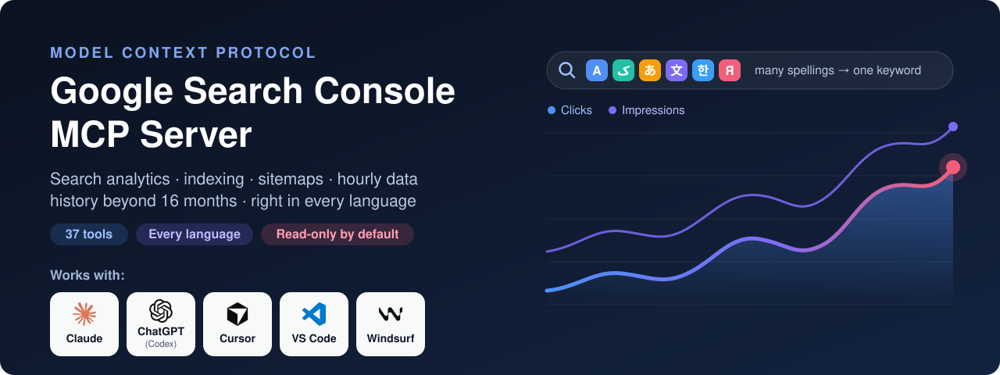
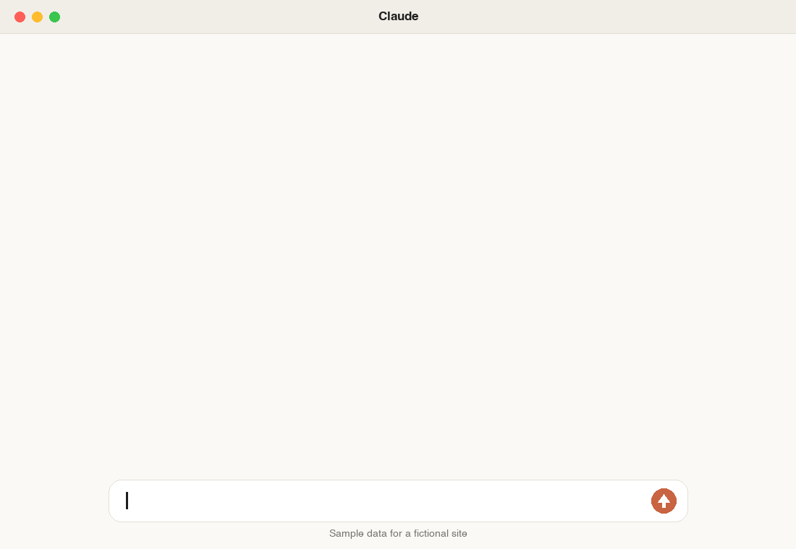

<p align="center"></p>

# Google Search Console MCP Server — gsc-mcp-full

**The complete MCP server for Google Search Console.** Ask Claude, Cursor, Windsurf, VS Code, Codex or any other MCP client about your search performance, indexing and sitemaps in plain language — and get analysis back, not a spreadsheet.

37 tools · every Search Console API endpoint · the 24-hour view and hourly data · history beyond 16 months · correct numbers in every language.

[](https://pypi.org/project/gsc-mcp-full/)
[](https://github.com/mamrrez/gsc-mcp-full/actions/workflows/ci.yml)
[](https://www.python.org/)
[](https://github.com/modelcontextprotocol/python-sdk)
[](https://github.com/mamrrez/gsc-mcp-full/blob/main/LICENSE)

**[Quick start](#quick-start)** · **[Tools](#tools)** · **[Languages](#languages)** · **[FAQ](#faq)** · **[Full docs](https://mamrrez.github.io/gsc-mcp-full/)** · **[Project page](https://hasanpour.com/tools/gsc-mcp-full/)**

---

<p align="center"></p>

## What you get

| | |
|---|---|
| ✅ **Complete** | All 10 live methods of the Search Console API, all 6 search types (web, image, video, news, Discover, Google News), all 7 dimensions including hourly, with contains, exact, exclude and regex filters. Nothing in the API is left out. |
| ⚡ **Fast** | Starts in under a second. Inspects up to 10 URLs in parallel, 50 per request, inside a time budget so a big batch never times out your client. Retries rate limits and server errors on its own. Groups 25,000 queries in about half a second. Questions about synced history never touch the network. |
| 🔄 **Current** | Built on MCP SDK 2.x. API coverage checked against Google's own API definition (October 2026). Mirrors the Performance report's newest options: the 24-hour view with preliminary data, and hourly, daily, weekly or monthly granularity. Tested on Linux, macOS and Windows with Python 3.10–3.13 on every change. |
| 🧠 **Answers, not exports** | Cannibalization, striking-distance keywords, under-performing titles, decaying pages, brand vs non-brand — worked out for you and returned as short tables your AI can reason about. |
| 🌍 **Right in every language** | Search Console splits one keyword into several rows when it is typed several ways. This server merges them — Persian, Arabic, Chinese, Japanese, Korean, Turkish, Vietnamese, Russian and more — so the totals are the real ones. |
| 🗄️ **No 16-month limit** | Sync your data into a local file once; compare this quarter with the same quarter two years ago, long after Google has deleted it. |
| 🕒 **Your timezone** | Search Console days are Pacific-Time days. Hourly data is re-cut into *your* local days. |
| 🎯 **Numbers you can trust** | Header totals are the real period totals, not a sum of the rows shown. Page URLs are never shortened, so they can be passed straight to the next tool. A failure is reported as an error with its reason, never as an empty result. Covered by 117 automated tests on Linux, macOS and Windows, and checked end to end against real properties. |
| 🔒 **Safe by default** | Read-only access unless you opt in. Runs on your machine; your sign-in never leaves it. No hosted service, no account, no telemetry. |
| 💸 **Free and light** | MIT licensed. Four dependencies. One command to run. |

**Works with:** Claude Desktop · Claude Code · Cursor · Windsurf · VS Code (Copilot agent mode) · OpenAI Codex CLI · any MCP client over stdio or HTTP.

## Tools

37 tools in 8 groups. You don't call them yourself — ask in plain language and your AI picks the right one.

🌍 merges spelling variants · 🗄️ can run on local history (any date range) · ✍️ needs write access (`GSC_ALLOW_WRITE=1`)

### 📊 Search performance

| Tool | What it gives you | Ask it like this |
|---|---|---|
| `performance_overview` | One-screen summary: totals, a daily, weekly or monthly trend, top queries and pages, devices, countries, data freshness | *"How did example.com do in the last 6 months, month by month?"* |
| `query_search_analytics` 🌍 | Any report you can build in Search Console: every dimension, search type and filter, with a query filter that also matches a term's other spellings | *"Top mobile queries from Germany containing 'klima' last month"* |
| `compare_periods` 🌍 | Two periods side by side with the biggest movers first — previous period, same dates last year, 52 weeks ago, or custom dates | *"Compare this month with the same month last year"* |
| `queries_for_page` 🌍 | Every query that brings traffic to one page | *"What do people search to land on /pricing/?"* |
| `pages_for_query` 🌍 | Which pages rank for one keyword and how impressions split between them | *"Which of my pages rank for 'air conditioner installation'?"* |
| `hourly_performance` | Search Console's 24-hour view, and hour-by-hour data for the last 10 days in your own timezone | *"Show the last 24 hours"* · *"Show last week as Tehran days"* |
| `data_freshness` | Which recent days and hours are final and which are still preliminary | *"Is yesterday's data complete yet?"* |

### 🎯 SEO opportunities

| Tool | What it gives you | Ask it like this |
|---|---|---|
| `striking_distance` 🌍🗄️ | Keywords ranking 8–20 with real demand, and the clicks you'd gain on page one | *"What are my quickest ranking wins?"* |
| `find_cannibalization` 🌍🗄️ | Keywords where two or more of your pages compete as separate results (sitelinks and `#section` links are not counted as competitors), ranked by wasted impressions | *"Where are my pages competing with each other?"* |
| `low_ctr_opportunities` 🌍🗄️ | Page-one results whose click-through rate is far below what their position should earn | *"Which titles should I rewrite first?"* |
| `content_movers` 🌍🗄️ | Pages or queries that decayed, rose, disappeared or appeared since the last period | *"Which pages lost traffic this month?"* |
| `brand_split` 🌍🗄️ | Brand vs non-brand traffic, with your brand matched in every script it's written in | *"How much of my traffic is non-brand?"* |

### 🌍 Multilingual intelligence

| Tool | What it gives you | Ask it like this |
|---|---|---|
| `query_variants` 🗄️ | Keywords that Search Console splits across spellings, with their real combined totals | *"Which keywords are split across spellings?"* |
| `language_breakdown` 🗄️ | Share of clicks and impressions by the language and script of the query | *"How much of my traffic is Arabic vs English?"* |
| `keyboard_mistypes` 🗄️ | Queries typed with the keyboard on the wrong layout (`ovdn lhadk` = «خرید ماشین») | *"Find searches typed on the wrong keyboard"* |
| `top_terms` 🗄️ | Most demanded words across all queries — including Chinese, Japanese and Thai, which have no spaces | *"What words appear most in my Japanese queries?"* |
| `build_query_regex` | A regex filter that works for non-English text, for the API or the Search Console UI | *"Give me a regex for خرید خودرو that matches every spelling"* |

### 🗄️ Unlimited history

| Tool | What it gives you | Ask it like this |
|---|---|---|
| `sync_history` | Copies your data into a local database, day by day, past Google's 16 months and row caps | *"Sync the last 16 months of example.com"* |
| `history_status` | What's stored: date range, days and rows per property | *"What history do I have saved?"* |
| `history_query` 🌍 | Any report over any stored date range | *"Top queries for all of 2025"* |
| `history_trend` 🌍 | Clicks, impressions, CTR and position per day, week or month | *"Monthly clicks for 'heat pump' over two years"* |
| `history_compare` 🌍 | Two stored periods against each other, however far apart | *"Q3 this year vs Q3 two years ago"* |
| `history_sql` | Your own read-only SQL against the stored data | *"Run this SQL on my history: …"* |

### 🔍 Indexing and URL inspection

| Tool | What it gives you | Ask it like this |
|---|---|---|
| `inspect_url` | Full inspection of one page: index status, last crawl, canonical, robots, sitemaps, rich results | *"Is /new-article/ indexed? What canonical did Google pick?"* |
| `inspect_urls` | Up to 50 pages inspected in parallel, as one table with separate index and rich-result verdicts | *"Inspect these 30 URLs"* |
| `indexing_summary` | Problems only: which pages are not indexed or fail structured data, and why | *"Which of these pages have indexing issues?"* |
| `inspection_quota` | How much of Google's daily inspection allowance is used | *"How many inspections do I have left today?"* |

### 🗺️ Sitemaps

| Tool | What it gives you | Ask it like this |
|---|---|---|
| `list_sitemaps` | Every submitted sitemap with URL counts, errors and warnings | *"List my sitemaps and their errors"* |
| `get_sitemap` | Details of one sitemap | *"When did Google last read sitemap.xml?"* |
| `submit_sitemap` ✍️ | Submit or resubmit a sitemap | *"Submit example.com/sitemap.xml"* |
| `delete_sitemap` ✍️ | Remove a sitemap from Search Console | *"Remove the old sitemap"* |

### 🏠 Properties

| Tool | What it gives you | Ask it like this |
|---|---|---|
| `list_properties` | Every property your account can see, with your permission level | *"List my Search Console properties"* |
| `get_property` | Details of one property — accepts `example.com` as well as the exact property URL | *"Do I own example.com in Search Console?"* |
| `add_property` ✍️ | Add a site to your account | *"Add newsite.com to Search Console"* |
| `remove_property` ✍️ | Remove a site from your account | *"Remove the old staging property"* |

### 🛠️ Utilities

| Tool | What it gives you | Ask it like this |
|---|---|---|
| `get_capabilities` | Sign-in status, access level, stored history and the tool list | *"Is Search Console connected?"* |
| `reauthenticate` | Sign in again to switch Google accounts | *"Switch to my other Google account"* |

Every parameter of every tool: [Tool reference](https://mamrrez.github.io/gsc-mcp-full/tools).

## Quick start

Three steps, about ten minutes, no cost. You need a Google account with access to Search Console.

### 1. Create your Google credentials

Google requires every app that reads Search Console to identify itself, so you create a free "OAuth client" once.

1. Open [Google Cloud Console](https://console.cloud.google.com/) and create a project (any name).
2. [Enable the Google Search Console API](https://console.cloud.google.com/apis/library/searchconsole.googleapis.com) for it.
3. Open [Credentials](https://console.cloud.google.com/apis/credentials) → **Create credentials** → **OAuth client ID**. If asked, fill in the consent screen first: type **External**, any app name, your own email.
4. Choose **Desktop app**, create it, and **Download JSON**. Keep the file somewhere permanent, for example `~/gsc/client_secret.json`.
5. On the consent screen page, click **Publish app**. Without this, Google signs you out every 7 days. No review is needed for personal use.

<details>
<summary>Using a service account instead (servers, scheduled jobs, teams)</summary>

1. In the same project: **IAM & Admin → Service accounts → Create service account**.
2. Open it → **Keys → Add key → Create new key → JSON**. Use this file instead of the OAuth one.
3. In Search Console → **Settings → Users and permissions → Add user**, add the service account's email address to each property.

No browser sign-in is needed with a service account; skip the `auth` command in step 3.
</details>

### 2. Connect your AI client

Install [uv](https://docs.astral.sh/uv/getting-started/installation/) if you don't have it (one command, shown on that page). It downloads and runs the server for you — there is nothing else to install.

Then add this to your client's MCP configuration, with the path to your own file:

```json
{
  "mcpServers": {
    "search-console": {
      "command": "uvx",
      "args": ["gsc-mcp-full"],
      "env": {
        "GSC_CREDENTIALS_PATH": "/Users/you/gsc/client_secret.json"
      }
    }
  }
}
```

<details>
<summary><b>Where that goes in each client</b></summary>

| Client | Where |
|---|---|
| **Claude Desktop** | Settings → Developer → Edit Config (`claude_desktop_config.json`) |
| **Cursor** | `~/.cursor/mcp.json`, or `.cursor/mcp.json` in a project |
| **Windsurf** | `~/.codeium/windsurf/mcp_config.json` |
| **VS Code** | `.vscode/mcp.json` — same content, but the top-level key is `"servers"` and each server needs `"type": "stdio"` |

**Claude Code** — one command instead of a file:

```sh
claude mcp add search-console -e GSC_CREDENTIALS_PATH=/Users/you/gsc/client_secret.json -- uvx gsc-mcp-full
```

**OpenAI Codex CLI** — in `~/.codex/config.toml`:

```toml
[mcp_servers.search-console]
command = "uvx"
args = ["gsc-mcp-full"]

[mcp_servers.search-console.env]
GSC_CREDENTIALS_PATH = "/Users/you/gsc/client_secret.json"
```

If a desktop app reports that it can't find `uvx`, use its full path as the command (`which uvx` on macOS/Linux, `where uvx` on Windows).
</details>

### 3. Sign in and ask

Sign in once from a terminal. Your browser opens; pick the Google account that has your Search Console properties.

```sh
export GSC_CREDENTIALS_PATH=~/gsc/client_secret.json
uvx gsc-mcp-full auth      # sign in (if Google warns the app is unverified: Advanced → Continue — it's your own app)
uvx gsc-mcp-full doctor    # should list your properties
```

Restart your AI client and ask:

> List my Search Console properties, then give me a performance overview of example.com.

Stuck? See [Troubleshooting](https://mamrrez.github.io/gsc-mcp-full/troubleshooting).

**Optional settings** worth adding to the `env` block: `"GSC_TIMEZONE": "Europe/Berlin"` for local-day reports and `"GSC_LANG": "fa"` (or `ar`, `tr`, `ja`…) if most of your queries are in one language. Prefer pip? `pip install gsc-mcp-full` gives you the same `gsc-mcp-full` command.

## Things to ask

- *"Run a weekly SEO report for example.com: overview, what moved, and my three best opportunities."*
- *"Which pages lost more than 30% of their clicks since last month, and which queries did they lose?"*
- *"Find keyword cannibalization and tell me which page should win each one."*
- *"Which page-one results have a weak click-through rate? Suggest better titles."*
- *"Check these 20 URLs for indexing problems."*
- *"Split my traffic into brand and non-brand. Brand terms: toyota, تویوتا."*
- *"Sync 16 months of history, then show monthly clicks for queries containing 'boiler'."*

More prompts and ready-made workflows: [Usage guide](https://mamrrez.github.io/gsc-mcp-full/usage).

## Languages

Search Console counts every distinct string as its own query. When the same search can be typed several ways, one keyword becomes several small rows:

| What people type | Rows in Search Console | What it really is |
|---|---|---|
| خرید ماشین کارکرده · خريد ماشين كاركرده · خرید ماشین كاركرده | 3 | one keyword |
| قیمت پژو ۲۰۶ · قیمت پژو 206 · قيمت پژو ٢٠٦ | 3 | one keyword |
| خرید bmw x5 · خريد BMW X5 | 2 | one keyword (mixed scripts are folded too) |
| ماشین دست‌دوم · ماشین دست دوم · ماشین دستدوم | 3 | one keyword (at the loose level) |
| エアコン · えあこん · ｴｱｺﾝ | 3 | one keyword |
| 에어컨 설치 · 에어컨설치 | 2 | one keyword |
| İstanbul klima · istanbul klima | 2 | one keyword |
| `ovdn lhadk` | 1 meaningless query | «خرید ماشین» typed with the keyboard still set to English |

Tools marked 🌍 merge these before analysing, with rules written for each script. The text you see is never altered; only the grouping changes. Two levels: **standard** merges the same word typed differently, **loose** also merges near-spellings.

| Language / script | standard | loose adds |
|---|---|---|
| Persian, Arabic, Urdu, Pashto | ی/ي/ى, ک/ك, ه/ة/ۀ, ا/أ/إ/آ; vowel marks; tatweel; half-space; Persian and Arabic-Indic digits | ؤ→و, ئ→ی, ء dropped, Urdu ے/ھ/ہ; spacing |
| Chinese | full-width forms, punctuation | Traditional→Simplified (with the `zh` extra) |
| Japanese | half-width katakana, dash typed for ー | hiragana↔katakana, middle dot |
| Korean | composed forms | spacing differences |
| Hindi and other Indic scripts | joiners are kept on purpose (there they change spelling) | — |
| Hebrew | vowel points | — |
| Turkish | dotted and dotless i handled correctly (`İ`→`i`, `I`→`ı`) | accents |
| Vietnamese, French, German, Spanish… | case, punctuation | diacritics (điều hòa = dieu hoa, straße = strasse) |
| Russian, Ukrainian | ё→е | — |
| Greek | case | accents, final sigma |

26 writing systems are recognised. English-only sites lose nothing: case, separators and spacing variants are merged for them too — while `c++`, `c#` and `.net` stay distinct, and `3.5` is never `35`.

For Chinese, Japanese and Thai, `top_terms` uses a real word segmenter when you install the extra — `uvx --from "gsc-mcp-full[zh]" gsc-mcp-full` (or `[ja]`, `[th]`, `[all]`). The reasoning behind every rule: [Languages guide](https://mamrrez.github.io/gsc-mcp-full/multilingual).

## History beyond 16 months

Google deletes Search Console data after 16 months and limits how many rows one request returns. `sync_history` stores each day in a local SQLite file, so both limits stop applying from the day you start.

```sh
uvx gsc-mcp-full sync example.com --days 480     # first run: everything Google still has
uvx gsc-mcp-full sync example.com --days 7       # daily, from cron: only new days are fetched
```

Every tool marked 🗄️ accepts `source="history"`. Details and a cron example: [History guide](https://mamrrez.github.io/gsc-mcp-full/history).

## Configuration

Settings are environment variables in your client's `env` block. Only the first is required.

| Variable | Default | Meaning |
|---|---|---|
| `GSC_CREDENTIALS_PATH` | — | Your OAuth client JSON or service-account key (detected automatically) |
| `GSC_TIMEZONE` | — | Your timezone for local-day reports, e.g. `Asia/Tehran`, `Europe/Berlin` |
| `GSC_LANG` | auto | Language hint when a query's script is ambiguous (`fa`, `ar`, `tr`…) |
| `GSC_ALLOW_WRITE` | off | `1` enables the ✍️ tools (then run `gsc-mcp-full auth --force` once) |
| `GSC_DATA_STATE` | `all` | `all` matches the Search Console UI; `final` returns only settled days |
| `GSC_CONFIG_DIR` | `~/.config/gsc-mcp-full` | Where your sign-in and history are kept |
| `GSC_TOKEN_PATH`, `GSC_DB_PATH` | inside config dir | Override individual file locations |
| `GSC_ROW_CAP` | `100000` | Most rows one tool call may fetch |
| `GSC_ALLOWED_HOSTS` | — | HTTP mode only: public host names allowed to reach the server through a proxy, comma-separated |
| `GSC_USE_ADC` | off | `1` to use Google Application Default Credentials on a cloud VM when no credentials file is set |
| `GSC_BIDI_ISOLATE` | off | `1` if right-to-left text renders scrambled in tables |

## Command line

```sh
gsc-mcp-full                    # run the server — what your AI client starts
gsc-mcp-full auth [--force]     # sign in with Google
gsc-mcp-full doctor             # check setup and list properties
gsc-mcp-full sync SITE --days N # store history locally
gsc-mcp-full serve --transport streamable-http --port 8000   # serve over HTTP instead of stdio
gsc-mcp-full tools              # print the tool reference
```

## Security

- **Read-only unless you say otherwise.** The default sign-in cannot change anything in Search Console.
- **Everything stays on your machine.** The server runs locally and talks only to Google. Your sign-in is stored in a file only you can read, and is never logged.
- **Write tools are locked** behind `GSC_ALLOW_WRITE=1` and checked on every call.
- **Search queries are treated as data.** Anyone can type anything into Google; nothing in your data can trigger an action.

More in the [Security guide](https://mamrrez.github.io/gsc-mcp-full/security). To report a vulnerability privately, see [SECURITY.md](https://github.com/mamrrez/gsc-mcp-full/blob/main/SECURITY.md).

## FAQ

**Is there an official Google Search Console MCP server?**
Not at the time of writing (October 2026). Google publishes an MCP server for Google Analytics but not for Search Console, so community servers like this one use Google's public Search Console API.

**Is it free?**
Yes. The server is open source under the MIT license, the Search Console API has no charge, and the Google Cloud project needs no billing account.

**Which AI assistants does it work with?**
Any MCP client: Claude Desktop, Claude Code, Cursor, Windsurf, VS Code in agent mode, OpenAI Codex CLI and others, over stdio or streamable HTTP.

**Can it change or break my site?**
No. It reads Search Console reports. With write access enabled it can add or remove properties and submit or delete sitemaps in Search Console — nothing on your website itself.

**How is it different from exporting to a spreadsheet?**
You ask a question and get the answer. The server fetches, merges spelling variants, runs the analysis and returns a short table, capped so it never floods your AI's context.

**Does it support Search Console's newest report options?**
The 24-hour view (hourly points, including preliminary data) and the hourly, daily, weekly and monthly granularity are all here: `hourly_performance` with `hours=24`, and `granularity` on `performance_overview` and `history_trend`. The newer split of web search into text-based and multimodal (Google Lens, Circle to Search) exists only in the Search Console UI; Google's API does not return it yet, so no MCP server can.

**Does it have the Page indexing, Core Web Vitals or Links reports?**
No — Google does not offer those through its API, so no MCP server can. Per-URL index status is available through the inspection tools.

**How far back does the data go?**
16 months from Google. Without limit once you start syncing history locally.

**Do I need to know Python?**
No. `uvx` runs everything; you only edit one configuration file.

## Development

```sh
git clone https://github.com/mamrrez/gsc-mcp-full && cd gsc-mcp-full
uv venv && uv pip install -e ".[dev,all]"
uv run pytest        # no network or credentials needed
uv run ruff check
uv run python scripts/live_check.py   # optional: read-only check of every tool against your own property
```

Contributions are welcome, especially language rules and real query samples — see [CONTRIBUTING.md](https://github.com/mamrrez/gsc-mcp-full/blob/main/CONTRIBUTING.md).

## Related

- [gtrends-mcp-full](https://github.com/mamrrez/gtrends-mcp-full) — the companion Google Trends MCP server: Trending Now, interest over time and by region, related searches, seasonality and share of search, with no API key.

## License

[MIT](https://github.com/mamrrez/gsc-mcp-full/blob/main/LICENSE) © [Mohammadreza Hasanpour](https://hasanpour.com/)

This project is not affiliated with or endorsed by Google. Google Search Console is a trademark of Google LLC.

<!-- mcp-name: io.github.mamrrez/gsc-mcp-full -->
